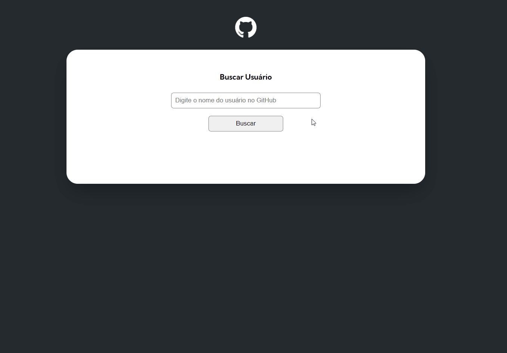

# Projeto GitHub API - buscando usuários com fetch

Esse projeto foi desenvolvido durante o curso DevQuest. A aplicação foi construída usando a API do GitHub com o objetivo de buscar e mostrar na tela os usuários do GitHub.
________________________________________________

### As solicitações feitas como desafio foram:
    - Mostrar número de seguidores do usuário
    - Mostrar número de pessoas que o usuário está seguindo
    - Apresentar os eventos de tipo CreateEvent e PushEvent e a mensagem do evento
    - Mostrar a quantidade de forks do repositório
    - Mostrar a quantidade de estrelas do repositório
    - Mostrar a quantidade de watchers do repositório
    - Mostrar a linguagem de programação do repositório
________________________________________________

### Captura de tela

__________________________________________________

### Links

- [Solução](https://github.com/flaviafigueredo/projeto-github-api)
- [GitHub Pages](https://flaviafigueredo.github.io/projeto-github-api/)
__________________________________________________

### Construído com

- HTML5
- CSS
- JavaScript
- API
__________________________________________________

### Autora

- Portfólio - [Flávia Figueredo](https://flaviafigueredo.github.io/mini-portfolio/)
- GitHub - [@flaviafigueredo](https://github.com/flaviafigueredo)